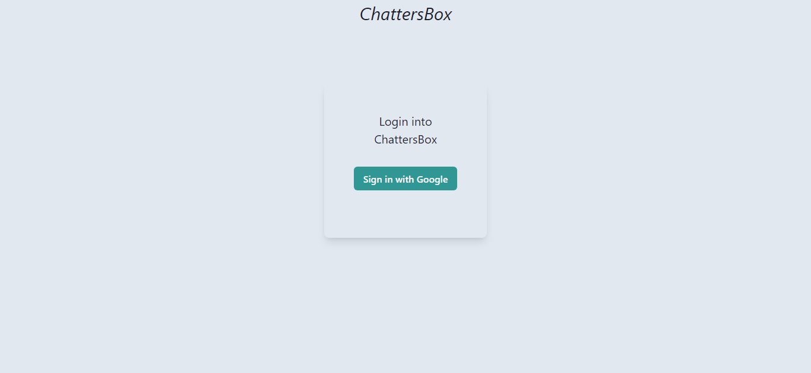
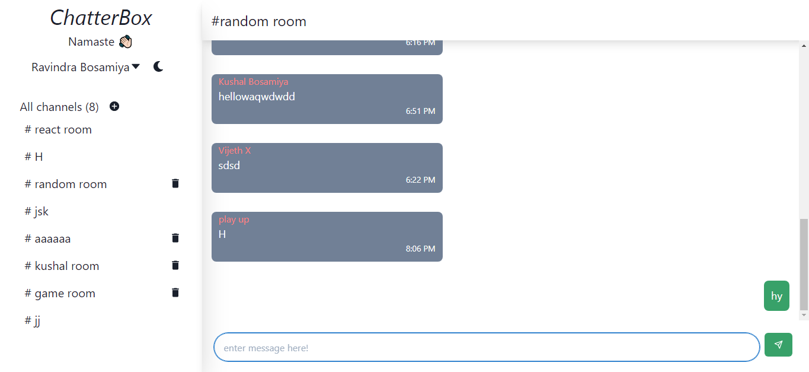
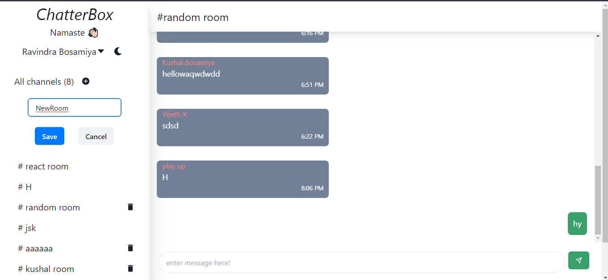
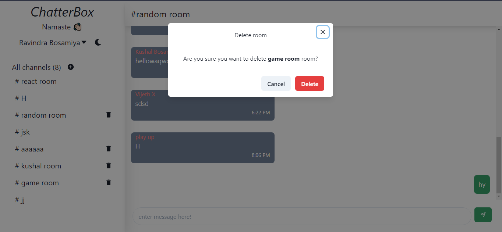
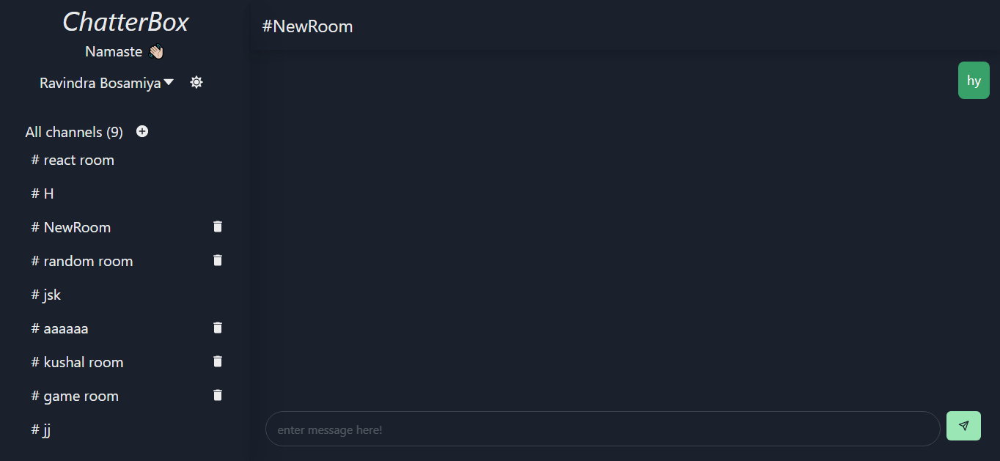

# Chatterbox
Chatterbox is a chat app made using firebase and react js. 

## Features
- Social login (google)
- Creat and delete chat room
- Dark Mode

## Demo 
[ChatterBox](http://chat.ravindrabosamiya.tech/)

## Tools 
- React js 
- Firebase

## Screenshots

Login Page

Home Page

Create new Room

Delete Chat room (can only delete room created by the user)

Home page in Dark Mode

### Contact me

<a href="mailto:rbosamiya9@gmail.com">
<button>Email</button>
</a>

<a href="https://api.whatsapp.com/send?phone=918866669219&text=Hey!">
<button>Chat</button>
</a>

Checkout my [website](https://ravindrabosamiya.tech/) 